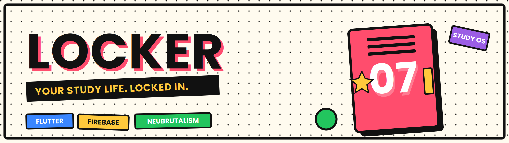

<div align="center">



<br/>

[](https://flutter.dev)
[](https://dart.dev)
[](https://firebase.google.com)
[]()
[](LICENSE)
[]()

**A study app where every subject is a locker you open — not a boring folder.**
Priority-colored calendars · ambient focus sounds · a study crew that keeps you accountable.

</div>

---

## Table of Contents

- [About](#about)
- [Features](#features)
- [Screenshots](#screenshots)
- [Tech Stack](#tech-stack)
- [Architecture](#architecture)
- [Getting Started](#getting-started)
- [Project Structure](#project-structure)
- [Roadmap](#roadmap)
- [Author](#author)

---

## About

**Locker** reimagines the study planner. Instead of stacking subjects in flat, forgettable folders, each one becomes a **locker** you unlock — giving the app a tactile, memorable identity. Urgency is communicated through **color** (high / medium / low priority paint your lockers, calendar, and tasks), focus is supported by a built-in **ambient sound mixer**, and motivation comes from seeing friends who are currently "locked in."

The whole experience is wrapped in a bold **neubrutalism** aesthetic — chunky borders, hard shadows, and loud, confident color.

> 🎓 Built as a mobile-first academic capstone project, designed for students.

---

## Features

| | Feature | What it does |
|:--:|:--|:--|
| 🔒 | **The Locker Wall** | Subjects rendered as openable lockers with an unlock animation — your signature interaction instead of generic folders. |
| 🚦 | **Priority Color System** | High / Medium / Low priority auto-color your lockers, calendar days, and tasks so urgency reads at a glance. |
| 📅 | **Priority Calendar** | Month view with color-coded deadlines and a clean daily agenda. |
| 🗓️ | **Class Scheduler** | Build your timetable; classes and deadlines flow straight into the calendar. |
| ⏱️ | **Focus Mode** | Pomodoro-style deep-work timer tied to a specific locker. |
| 🎧 | **Ambient Sound Mixer** | Layer rain, café, lo-fi, forest, and brown noise — save your own study blends. |
| 👥 | **Study Crew** | Connect with friends, see live "locked in" presence, and compare weekly focus hours. |
| 🔥 | **Streaks & Stickers** | Earn collectible locker stickers for staying consistent. |
| 🔐 | **Auth & Onboarding** | Secure sign up / log in with a guided first-run experience. |

---

## Screenshots

> _Add your exported Figma / app frames here._

| Onboarding | Locker Wall | Priority Calendar | Focus + Ambient |
|:--:|:--:|:--:|:--:|
| _coming soon_ | _coming soon_ | _coming soon_ | _coming soon_ |

---

## Tech Stack

| Layer | Technology |
|:--|:--|
| **Frontend** | Flutter (Dart) |
| **State Management** | Riverpod *(swap for Provider / BLoC if preferred)* |
| **Database** | Cloud Firestore (NoSQL) |
| **Authentication** | Firebase Authentication |
| **Notifications** | Firebase Cloud Messaging (FCM) |
| **Server-side logic** | Cloud Functions for Firebase |
| **Storage** | Firebase Storage *(ambient assets / avatars)* |

> **Architecture note:** Locker runs a serverless (BaaS) architecture — Flutter talks to Firebase directly, with Cloud Functions handling the few server-side jobs (leaderboard rollups, scheduled reminders). A thin FastAPI layer can be added later if heavier custom logic is needed.

---

## Architecture

```
┌─────────────────────────────┐
│         Flutter App         │
│   UI · State · Local Cache  │
└──────────────┬──────────────┘
               │
     ┌─────────┴──────────┐
     │   Firebase (BaaS)  │
     ├────────────────────┤
     │ • Authentication   │
     │ • Cloud Firestore  │
     │ • Cloud Storage    │
     │ • Cloud Messaging  │
     │ • Cloud Functions  │ ◄── leaderboard rollups · reminders
     └────────────────────┘
```

---

## Getting Started

### Prerequisites

- [Flutter SDK](https://docs.flutter.dev/get-started/install) (stable channel)
- A [Firebase](https://console.firebase.google.com/) project
- Android Studio / VS Code with the Flutter & Dart plugins
- [FlutterFire CLI](https://firebase.flutter.dev/docs/cli/) — `dart pub global activate flutterfire_cli`

### Installation

```bash
# 1. Clone the repository
git clone https://github.com/<your-username>/locker.git
cd locker

# 2. Install dependencies
flutter pub get

# 3. Connect Firebase (generates firebase_options.dart)
flutterfire configure

# 4. Run the app
flutter run
```

### Firebase Setup

1. Create a project in the [Firebase Console](https://console.firebase.google.com/).
2. Register your **Android** and/or **iOS** app.
3. Enable **Authentication** (Email/Password), **Cloud Firestore**, **Storage**, and **Cloud Messaging**.
4. Run `flutterfire configure` to wire everything up.
5. Set proper Firestore **security rules** before going live.

> ⚠️ Never commit `google-services.json`, `GoogleService-Info.plist`, or `firebase_options.dart` to a public repo. Add them to `.gitignore`.

---

## Project Structure

<details>
<summary><b>Click to expand</b></summary>

```
lib/
├── main.dart
├── core/                 # shared utilities, theme, constants
│   ├── theme/            # neubrutalism design tokens
│   └── utils/
├── features/             # feature-first organization
│   ├── auth/             # login, signup, onboarding
│   ├── lockers/          # locker wall + locker detail
│   ├── calendar/         # priority calendar
│   ├── scheduler/        # class scheduler
│   ├── focus/            # pomodoro + ambient mixer
│   └── social/           # study crew + presence + leaderboard
└── shared/               # reusable widgets
```

Each feature follows a clean layered structure: `presentation/` · `domain/` · `data/`.

</details>

---

## Roadmap

- [ ] Locker unlock animation (combo-lock interaction)
- [ ] Priority color system across all views
- [ ] Pomodoro focus timer
- [ ] Ambient sound mixer with saved presets
- [ ] Live "locked in" presence
- [ ] Weekly focus-hours leaderboard
- [ ] Streak stickers
- [ ] Push notification reminders

---

## Author

**Joel** — BSIT Student
<div align="center">

<br/>

*Built with Flutter & Firebase · Locked in.* 🔒

</div>
